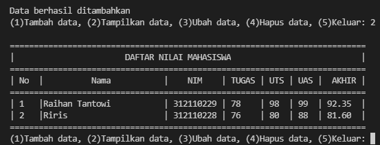
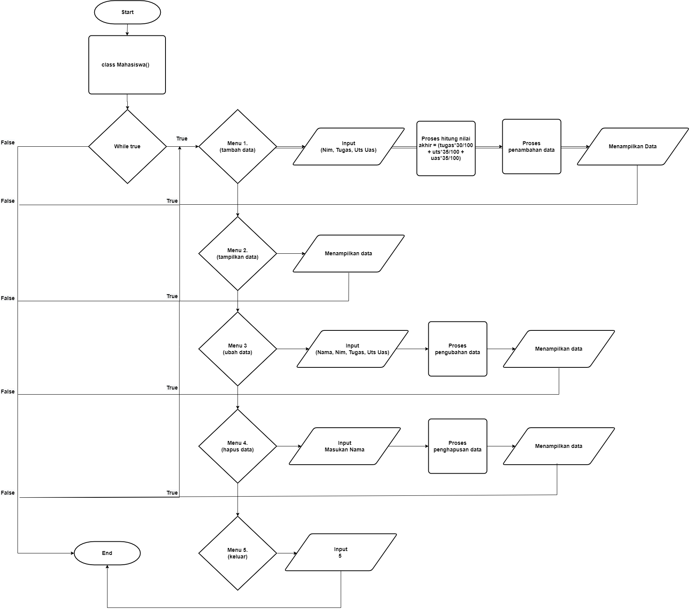
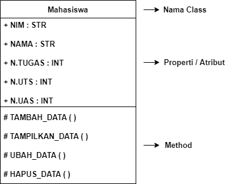

# Praktikum8
## Tugas Pertemuan 12 - Bahasa Pemrograman

```sh
Nama   : Raihan Tantowi
Nim    : 312110229
Matkul : Bahasa Pemrograman
```

### 1. File Praktikum.py
Program ini adalah program sederhana daftar nilai mahasiswa yang dibuat dengan mengaplikasikan penggunaan class.

* **CODINGAN**
```python
class Mahasiswa():
    def judul():
        print("=" * 35)
        print("|  PROGRAM INPUT NILAI MAHASISWA  |")
        print("=" * 35)
        print('| 1. Tambah Data                  |')
        print('| 2. Tampilkan Data               |')
        print('| 3. Ubah Data                    |')
        print('| 4. Hapus Data                   |')
        print('| 5. Exit                         |')
        print("=" * 35)
    
    judul()

    def __init__(self, nim, nama, tugas, uts, uas):
        self.nim = nim
        self.nama = nama
        self.tugas = tugas
        self.uts = uts
        self.uas = uas

    def tambah(self,nim,nama,tugas,uts,uas):
        data.nim.append(nim)
        data.nama.append(nama)
        data.tugas.append(tugas)
        data.uts.append(uts)
        data.uas.append(uas)

    def lihat(self):
        for i in range(len(data.nama)):
            print("|", i+1, "  |", end="")
            print('{0:<25}'.format(self.nama[i]), end="")
            print("|", self.nim[i], end="")
            print(" |", self.tugas[i], end="")
            print("    |", self.uts[i], end="")
            print("  |", self.uas[i], " | ", end="")
            print(f'{((self.tugas[i]*30/100) + (self.uts[i]*35/100) + (self.uas[i]*35/100)) :.2f}', " |")

    def ubah(self,nim,nama,tugas,uts,uas):
        self.nim[no] = nim
        self.nama[no] = nama
        self.tugas[no] = tugas
        self.uts[no] = uts
        self.uas[no] = uas

    def hapus(self):
        del self.nim[no]
        del self.nama[no]
        del self.tugas[no]
        del self.uts[no]
        del self.uas[no]

data = Mahasiswa([],[],[],[],[])

while True:
    menu = input("(1)Tambah data, (2)Tampilkan data, (3)Ubah data, (4)Hapus data, (5)Keluar: ")
    if menu == "1" :
       print("\nTambah Data")
       data.tambah(
           input("Masukkan NIM \t : "), 
           input("Masukkan Nama\t : "), 
           int(input("Nilai Tugas\t : ")), 
           int(input("Nilai UTS\t : ")), 
           int(input("Nilai UAS\t : "))
           )
       print("\nData berhasil ditambahkan")

    elif menu == "2" :
        print()
        print("=" *74)
        print("|" + "\t" * 3 + "DAFTAR NILAI MAHASISWA" + "\t" * 3 +  "         |")
        print("="*74)
        print("| No  |          Nama           |    NIM    | TUGAS | UTS | UAS |  AKHIR |")
        print("="*74)
        if len(data.nama) != 0:
            data.lihat()
        else:
            print("                             TIDAK ADA DATA                           ")
        print("="*74)

    elif menu == "3" :
        print("\nUbah Data")
        print("#Masukkan Nama Yang Telah Diinput")
        ubah = input("Masukkan Nama : ")
        if ubah in data.nama:
           no = data.nama.index(ubah)
           print()
           print("#Masukkan Data Yang Baru")
           data.ubah(
               input("Masukkan NIM \t : "), 
               input("Masukkan Nama\t : "), 
               int(input("Nilai Tugas\t : ")), 
               int(input("Nilai UTS\t : ")), 
               int(input("Nilai UAS\t : "))
               )
        else:
            print(ubah, "tidak ada di dalam data")

    elif menu == "4" :
        print("\nHapus Data")
        print("#Masukkan Nama Yang Telah Diinput")
        hapus = input("Masukkan Nama : ")
        if hapus in data.nama:
            no = data.nama.index(hapus)
            data.hapus()
            print("Data", hapus, "Berhasil dihapus")
        else:
            print(hapus, "tidak ada di dalam data")

    elif menu == "5" :
        print("\nThank You :)\n")
        break

    else:
        print("\nPerintah yang dimasukkan salah!\n")
```

* **Hasil output program:**

Berikut hasil output program data nilai mahasiswa menggunakan class 



* **Flowchart:**

Berikut flowchart dari program data nilai mahasiswa.


* **Diagram Class:**

Berikut Diagram Class dari program data nilai mahasiswa.



* **Penjelasan program:**

1. Langkah pertama adalah membuat/mendeklarasikan sebuah class Mahasiswa yang didalamnya terdapat atribut NIM, Nama, nilai tugas, nilai UTS dan nilai UAS. Dan untuk mendeklarasikan sebuah class didalam OOP kita harus gunakan def__init__ dan juga self
	```python
    class Mahasiswa():
        def __init__(self, nim, nama, tugas, uts, uas):
        self.nim = nim
        self.nama = nama
        self.tugas = tugas
        self.uts = uts
        self.uas = uas
	```
2. Kodingan dibawah merupakan sebuah tabel program yang didalamnya terdapat menu. Dan jika ingin memanggil fungsinnya dengan cara ketikan "menutabel()".
    ```python
    def menutabel():
    print("=" * 35)
    print("|  PROGRAM INPUT NILAI MAHASISWA  |")
    print("=" * 35)
    print('| 1. Tambah Data                  |')
    print('| 2. Tampilkan Data               |')
    print('| 3. Hapus Data                   |')
    print('| 4. Ubah Data                    |')
    print('| 5. Exit                         |')
    print("=" * 35)
    
menutabel()
    ```

3. Disini kita perlu menambahkan method seperti menambahkan, menampilkan, menghapus, dan mengubah data mahasiswa. Pada sebuah method tambah()   ini berfungsi untuk menambahkan data. Dalam method ini kita menggunakan append() supaya data yang terakhir ditambahkan, ada di urutan listv paling akhir.
    ```python
     def tambah(self,nim,nama,tugas,uts,uas):
        data.nim.append(nim)
        data.nama.append(nama)
        data.tugas.append(tugas)
        data.uts.append(uts)
        data.uas.append(uas)
    ```
    
4. Method lihat(), Berguna untuk menampilkan seluruh data yang telah ditambahkan. Bilamana data tersebut belum diinput/data tersebut sudah terhapus, Maka akan keluar ouput dengan tulisan "TIDAK ADA DATA". Kita menggunakan for loop untuk menampilkan banyaknya data. Nantinya data akan ditampilkan sebanyak n kali.
    ```python
    def lihat(self):
     for i in range(len(data.nama)):
         print("|", i+1, "  |", end="")
         print('{0:<25}'.format(self.nama[i]), end="")
         print("|", self.nim[i], end="")
         print(" |", self.tugas[i], end="")
         print("    |", self.uts[i], end="")
         print("  |", self.uas[i], " | ", end="")
         print(f'{((self.tugas[i]*30/100) + (self.uts[i]*35/100) + (self.uas[i]*35/100)) :.2f}', " |")
        ```

5. Method ubah() ini berfungsi sebagai menu mengubah data yang telah diinput, Inputan tersebut didalamnya terdapat atribut nama, Sedangkan untuk penginputan sebuah nim, tugas, uts, dan uas dapat kita ubah sesuai kebutuhan.
    ```python
    def ubah(self,nim,nama,tugas,uts,uas):
        self.nim[no] = nim
        self.nama[no] = nama
        self.tugas[no] = tugas
        self.uts[no] = uts
        self.uas[no] = uas
    ```
6. Kodingan ini digunakan untuk penghapusan sebuah data pada program yang sebelumnya telah diinput. Dan inputan dari kodingan ini berdasarkan "nama" yang sebelumnya telah diinput.
    ```python
    def hapus(self):
        del self.nim[no]
        del self.nama[no]
        del self.tugas[no]
        del self.uts[no]
        del self.uas[no]
    ```
7. Dan untuk menjalankan program bisa dipanggil melalui masing-masing methods, seperti pada sebuah while loop yang didalamnya Terdapat conditional seperti kodingan dibawah ini.    
    ```python
    while True:
    menu = input("(1)Tambah data, (2)Tampilkan data, (3)Ubah data, (4)Hapus data, (5)Keluar: ")
    if menu == "1" :
       print("\nTambah Data")
       data.tambah(
           input("Masukkan NIM \t : "), 
           input("Masukkan Nama\t : "), 
           int(input("Nilai Tugas\t : ")), 
           int(input("Nilai UTS\t : ")), 
           int(input("Nilai UAS\t : "))
           )
       print("\nData berhasil ditambahkan")

    elif menu == "2" :
        print()
        print("=" *74)
        print("|" + "\t" * 3 + "DAFTAR NILAI MAHASISWA" + "\t" * 3 +  "         |")
        print("="*74)
        print("| No  |          Nama           |    NIM    | TUGAS | UTS | UAS |  AKHIR |")
        print("="*74)
        if len(data.nama) != 0:
            data.lihat()
        else:
            print("                             TIDAK ADA DATA                           ")
        print("="*74)

    elif menu == "3" :
        print("\nUbah Data")
        print("#Masukkan Nama Yang Telah Diinput")
        ubah = input("Masukkan Nama : ")
        if ubah in data.nama:
           no = data.nama.index(ubah)
           print()
           print("#Masukkan Data Yang Baru")
           data.ubah(
               input("Masukkan NIM \t : "), 
               input("Masukkan Nama\t : "), 
               int(input("Nilai Tugas\t : ")), 
               int(input("Nilai UTS\t : ")), 
               int(input("Nilai UAS\t : "))
               )
        else:
            print(ubah, "tidak ada di dalam data")

    elif menu == "4" :
        print("\nHapus Data")
        print("#Masukkan Nama Yang Telah Diinput")
        hapus = input("Masukkan Nama : ")
        if hapus in data.nama:
            no = data.nama.index(hapus)
            data.hapus()
            print("Data", hapus, "Berhasil dihapus")
        else:
            print(hapus, "tidak ada di dalam data")
    ```

8. Mendeklarasikan satu dictionary kosong sebagai tempat menyimpan data-data yang sudah kita input. Disini ada 5 list kosong yang nanti isinya terdapat NIM, Nama, nilai tugas, nilai UTS dan nilai UAS. 
    ```python
    data = mahasiswa([],[],[],[],[])
    ```

9. Jika data sudah selesai diinput, Pilih menu ke 5 yaitu "5"(Keluar), Maka program secara otomatis akan berhenti.
    ```python
    elif menu == "5" :
        print("\nThank You :)\n")
        break

    else:
        print("\nPerintah yang dimasukkan salah!\n")
    ```
10. Sekian Terima Kasih :)